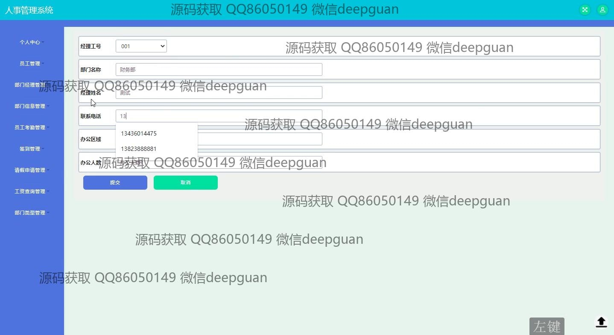
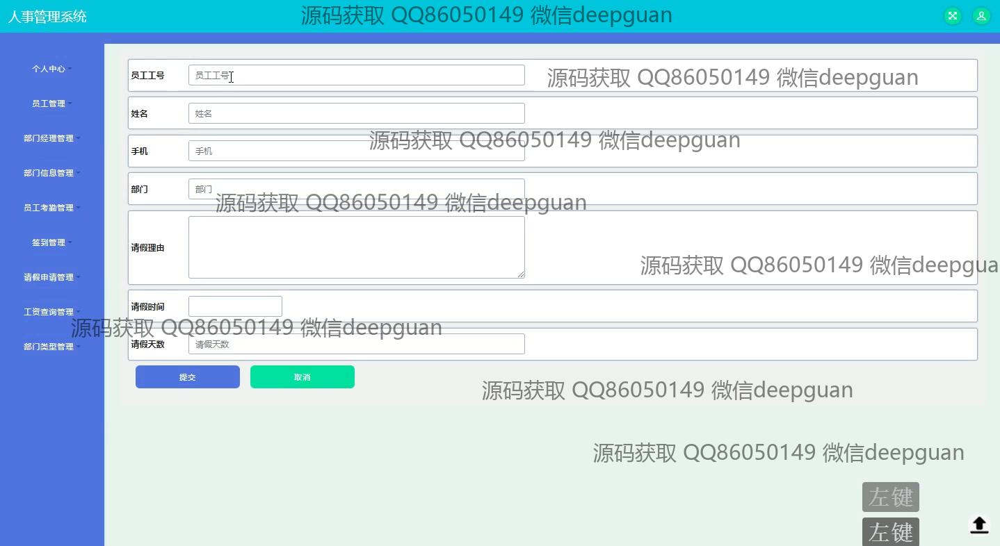
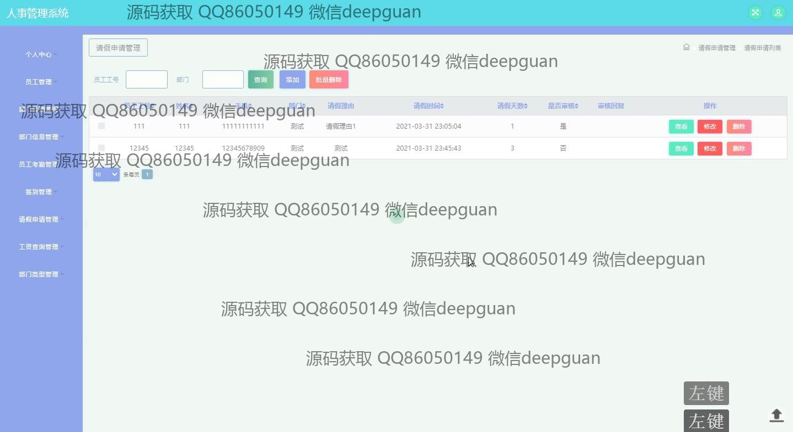

<h1 align="center">人事员工考勤签到请假管理系统</h1>

## 简介
人事管理系统：角色分为管理员、用户；支持员工信息管理、部门管理、考勤签到、请假审批、工资查询、数据统计与报表导出功能，界面简洁，操作便捷。    --计算机毕业设计源码；毕设源码；java毕业设计源码

## 联系方式

<h3 align="center">获取完整代码与数据库文件 + 微信：deepguan QQ: 86050149 QQ群: 783742310</h3>

<h3 align="center">可帮忙远程部署 包运行成功！提供远程部署、修改代码、设计文档指导、代码讲解等服务！</h3>

## 功能介绍（完整见运行截图）
管理员：管理员可以通过管理界面执行员工管理、部门管理、考勤管理、签到管理、请假审批及工资查询等操作。他们可以添加、修改和删除员工信息，处理请假申请并审核记录，管理部门信息和办公资源。考勤模块提供打卡记录的查询与统计，通过综合管理模块实现员工工资数据的计算与审核。

员工：员工可以通过用户界面查看和更新个人信息，进行考勤签到和请假申请。他们可以提交基本信息如联系方式、邮箱和身份证号，查看考勤记录，申请并查询请假状态。在工资查询模块中，员工可查看工资详情，包括基本工资、加班工资、绩效以及扣款信息，实现个人工资的透明查询。

## 运行截图

本代码来源于网络,仅供学习参考使用!

